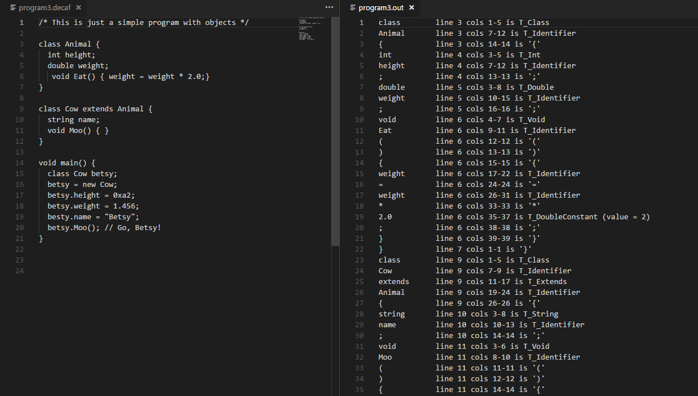
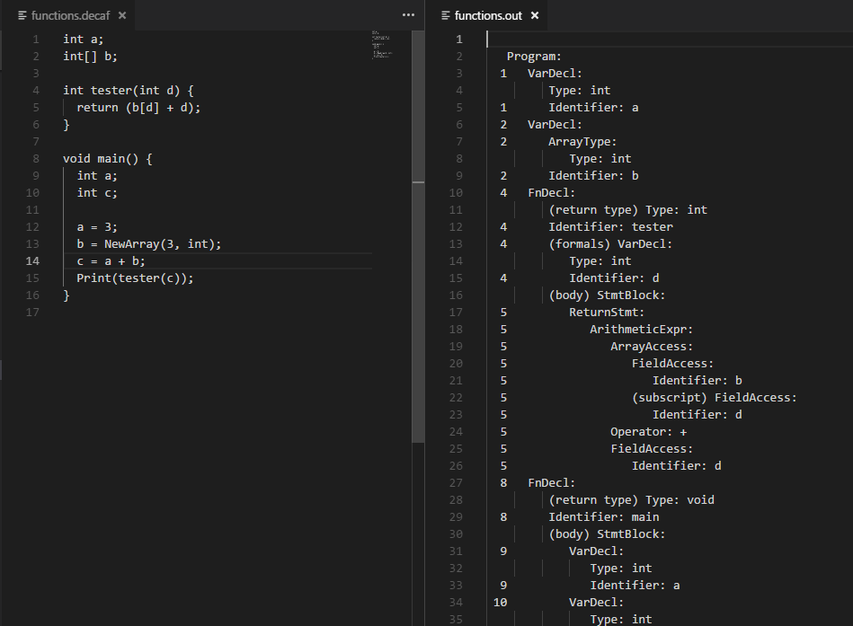
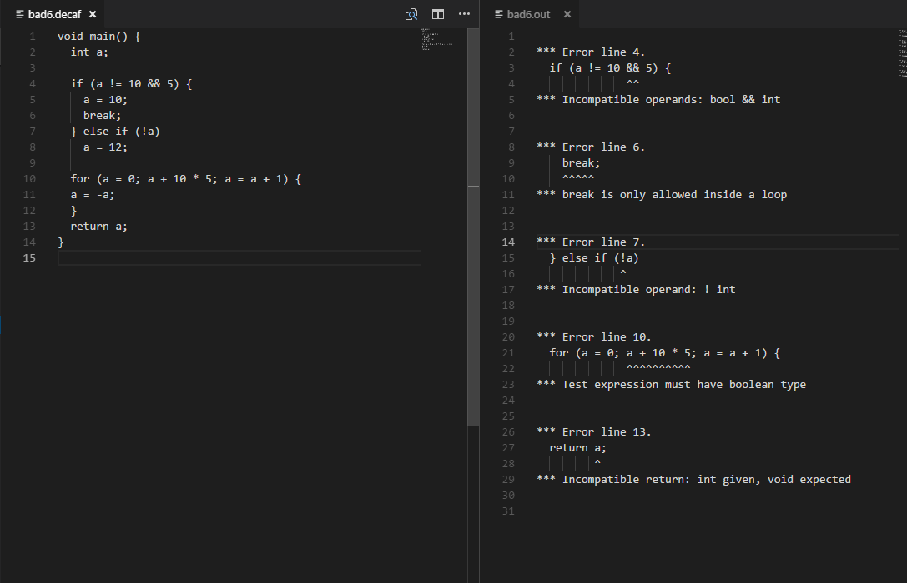
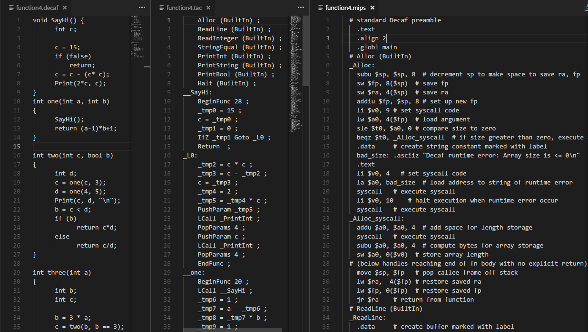
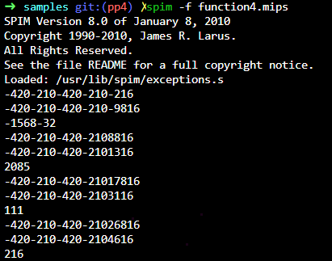

# decaf-compiler
HUST decaf-mind-compiler lab from stanford cs143

## PP1 - Lexical Analysis

### The Goal

For the first task of the frontend, you will use flex to create a scanner for the Decaf programming language. Your scanner will transform the source file from a stream of bits and bytes into a series of meaningful tokens containing information that will be used by the later stages of the compiler.

### Strategy

Build the scanner with FLEX according to the specification of Decaf. To be more staightforward, when a keyword(operator, constant, etc.) is read from the stream of source file, we should recognize it and return a meaningful token which can be used by the syntax analysis later.

### Screenshot

## PP2 - Syntax Analysis

### The Goal

The parser will read Decaf source programs and construct a parse tree. If no syntax errors are encountered, your code will print the completed parse tree as flat text. At this stage, you aren’t responsible for verifying meaning, just structure.

### Strategy

After familiar with the grammar of Decaf, we can build the parser which can build the Abstract Syntax Tree of a decaf program according to its structure and check for the error of grammar structure. First we should build the parser with BISON. The parser can read tokens generated from lexical analysis  and check if there is an error by shift and reduce. After that, we can write the codes which can build the AST along with the shifting and reduce period. 

### Screenshot

## PP3 - Semantic Analysis

### The Goal

Your semantic analyzer will traverse your parse tree (as many times as is necessary) and validate that the semantic rules of the language are being respected, printing appropriate error messages for violations.

### Strategy

In this period, we will traverse the AST built in the syntax analysis and implement the Check method which can check if there is a semantic error for each node. First we shoule build scope for each node which can help identify if a variable or a class or a function is declared and if it is visible or shadowed. And the scope can give us a lot of information of a specific node. After that we can accomplish the checkpoints of semantic analysis one by one by implementing the Check methods.

### Screenshot

## PP4 - TAC Generation

### The Goal

In the final project, you will implement a back end for your compiler that will generatecode to be executed on the SPIM simulator. Finally, you get to the true product of all your labor—running Decaf programs! 

This pass of your compiler will traverse the abstract syntax tree, stringing together the appropriate TAC instructions for each subtree—to assign a variable, call a function, or whatever is needed. Those TAC instructions are then translated into MIPS assembly via a translator class we provide that deals with the more grungy details of the machine code. Your finished compiler will do code generation for all of the Decaf language (with a few minor omissions) as well as reporting link and runtime errors.

### Strategy

As in the semantic analysis period, we will traverse the AST and at this time we shoule implement the Emit method which is able to generate a TAC instruction when it is needed. When a TAC instruction is generated, the class MIPS can translate it to a series of mips instructions which can be executed in spim(MIPS simulator). In order to generate TAC instructions, we can implement a codeGenerator class which can generate TAC instructions by using the interfaces providing by MIPS class. Then we can do the TAC generation of operators, statements, functions, classes, etc. and finally run the decaf program.

### Screenshot

